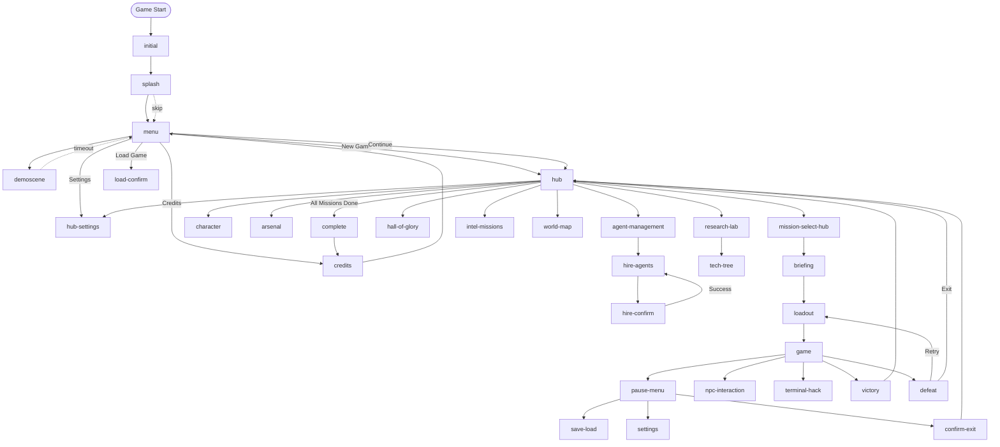

# Complete Game State Machine

## ALL GAME STATES (Converted + Unconverted)

### Entry/Menu States (Unconverted - Imperative)
1. **initial** - First screen on load
2. **splash** - Splash screens sequence (showSplashScreens)
3. **demoscene** - Attract mode demo (startDemosceneIdleTimer)
4. **menu** - Main menu (showMainMenu)
5. **credits** - Credits screen (showCredits)
6. **complete** - Game complete screen (showGameComplete)

### Hub States (Mixed)
7. **hub** - Syndicate hub main screen (showSyndicateHub - Imperative)
8. **agent-management** - Agent management menu (✅ Declarative) ⚠️ DUPLICATE: showAgentManagement() still exists
9. **hire-agents** - Hire agents list (✅ Declarative)
10. **hire-confirm** - Hire confirmation (✅ Declarative)
11. **hire-success** - Hire success notification (✅ Declarative) **[NEW FOUND]**
12. **character** - Character RPG sheet (✅ Declarative) ⚠️ DUPLICATE: showCharacterSheet() still exists
13. **arsenal** - Equipment/weapons (✅ Declarative) ⚠️ DUPLICATE: showArsenal() still exists
14. **research-lab** - Research menu (✅ Declarative) ⚠️ DUPLICATE: showResearchLab() + showResearchLabOld()
15. **tech-tree** - Technology tree (✅ Declarative)
16. **hall-of-glory** - Fallen agents memorial (✅ Declarative) ⚠️ DUPLICATE: showHallOfGlory() still exists
17. **mission-select-hub** - Mission selection (✅ Declarative) ⚠️ DUPLICATE: showMissionSelectDialog() still exists
18. **intel-missions** - Intel reports (✅ Declarative) **[MISSING FROM MATRIX]**
19. **hub-settings** - Hub settings (✅ Declarative) **[MISSING FROM MATRIX]**
20. **world-map** - World control map (showWorldMap - Imperative)

### Mission Flow States (Unconverted - Imperative)
21. **briefing** - Mission briefing screen (showBriefingScreen)
22. **loadout** - Agent loadout selection (showLoadoutSelection)
23. **game** - Main gameplay (startMission)

### In-Game States (Mixed)
24. **pause-menu** - Pause menu (✅ Declarative) ⚠️ DUPLICATE: showPauseMenu() still exists with old code
25. **save-load** - Save/load menu (✅ Declarative)
26. **settings** - In-game settings (✅ Declarative)
27. **npc-interaction** - NPC dialog (✅ Declarative) ⚠️ DUPLICATE: showNPCDialog() in modal-engine.js
28. **terminal-hack** - Terminal hacking (showTerminalHack - Imperative)
29. **victory** - Mission victory screen (showVictoryScreen - Imperative)
30. **defeat** - Mission defeat screen (showDefeatScreen - Imperative)

### Modal/Overlay States (Unconverted - Imperative)
31. **confirm-surrender** - Surrender confirmation (showHudDialog)
32. **confirm-exit** - Exit to hub confirmation (showHudDialog)
33. **sell-confirm** - Sell item confirmation (showHudDialog) **[INTEGRATED INTO ARSENAL]**
34. **buy-confirm** - Buy item confirmation (showHudDialog) **[INTEGRATED INTO ARSENAL]**
35. **insufficient-funds** - Not enough credits warning (showHudDialog)
36. **save-confirm** - Save slot overwrite confirmation (showHudDialog)
37. **load-confirm** - Load game confirmation (showHudDialog)
38. **delete-confirm** - Delete save confirmation (showHudDialog)

## COMPLETE STATE TRANSITION FLOW



## DETAILED STATE TRANSITION MATRIX

### ENTRY & MENU TRANSITIONS
| ID | From | To | Trigger | System | Status |
|----|------|-----|---------|---------|--------|
| E01 | START | initial | Game load | DOM ready | ❌ Imperative |
| E02 | initial | splash | Auto/Click | showSplashScreens() | ❌ Imperative |
| E03 | splash | menu | Timer/Skip | showMainMenu() | ❌ Imperative |
| E04 | menu | demoscene | Idle timeout | startDemoscene() | ❌ Imperative |
| E05 | demoscene | menu | Any input | exitDemoscene() | ❌ Imperative |
| E06 | menu | hub | "New Game" | showSyndicateHub() | ❌ Imperative |
| E07 | menu | hub | "Continue" | loadAndContinue() | ❌ Imperative |
| E08 | menu | load-confirm | "Load Game" | showLoadDialog() | ❌ Imperative |
| E09 | menu | settings | "Settings" | showSettingsMenu() | ❌ Imperative |
| E10 | menu | credits | "Credits" | showCredits() | ❌ Imperative |
| E11 | credits | menu | "Back"/ESC | showMainMenu() | ❌ Imperative |
| E12 | splash | menu | Skip (Space/Enter/Click) | showMainMenu() | ❌ Imperative |
| E13 | any | initial | Page Refresh | location.reload() | System |

### HUB TRANSITIONS
| ID | From | To | Trigger | System | Status |
|----|------|-----|---------|---------|--------|
| H01 | hub | agent-management | "MANAGE AGENTS" | navigateTo('agent-management') | ✅ Declarative |
| H02 | hub | character | "CHARACTER"/C key | navigateTo('character') | ✅ Declarative |
| H03 | hub | arsenal | "ARSENAL"/I key | navigateTo('arsenal') | ✅ Declarative |
| H04 | hub | research-lab | "RESEARCH LAB" | navigateTo('research-lab') | ✅ Declarative |
| H05 | hub | hall-of-glory | "HALL OF GLORY" | navigateTo('hall-of-glory') | ✅ Declarative |
| H06 | hub | mission-select-hub | "MISSIONS" | navigateTo('mission-select-hub') | ✅ Declarative |
| H07 | hub | intel-missions | "INTELLIGENCE" | navigateTo('intel-missions') | ✅ Declarative |
| H08 | hub | hub-settings | "SETTINGS" | navigateTo('hub-settings') | ✅ Declarative |
| H09 | hub | world-map | "WORLD MAP" | showWorldMap() | ❌ Imperative |
| H10 | hub | menu | "EXIT TO MENU" | showMainMenu() | ❌ Imperative |
| H11 | agent-management | hire-agents | "HIRE NEW AGENTS" | navigate:hire-agents | ✅ Declarative |
| H12 | hire-agents | hire-confirm | Agent "HIRE" button | navigate:hire-confirm | ✅ Declarative |
| H13 | hire-confirm | hire-success | Confirm success | navigateTo('hire-success') | ✅ Declarative |
| H14 | hire-success | hire-agents | Auto/Click | navigateTo('hire-agents', null, true) | ✅ Declarative |
| H15 | research-lab | tech-tree | "VIEW TECH TREE" | navigate:tech-tree | ✅ Declarative |

### MISSION FLOW TRANSITIONS
| ID | From | To | Trigger | System | Status |
|----|------|-----|---------|---------|--------|
| M01 | hub | mission-select-hub | "Missions" card | navigateTo('mission-select-hub') | ✅ Declarative |
| M02 | mission-select-hub | briefing | Mission select | showBriefingScreen() | ❌ Imperative |
| M03 | briefing | loadout | "Proceed" | showLoadoutSelection() | ❌ Imperative |
| M04 | briefing | mission-select-hub | "Back" | back to selection | ❌ Imperative |
| M05 | loadout | game | "Start Mission" | startMission() | ❌ Imperative |
| M06 | loadout | briefing | "Back" | showBriefingScreen() | ❌ Imperative |
| M07 | game | victory | Objectives complete | showVictoryScreen() | ❌ Imperative |
| M08 | game | defeat | All agents dead | showDefeatScreen() | ❌ Imperative |
| M09 | victory | hub | "Continue" | showSyndicateHub() | ❌ Imperative |
| M10 | victory | credits | Final mission | showCredits() | ❌ Imperative |
| M11 | defeat | loadout | "Retry" | showLoadoutSelection() | ❌ Imperative |
| M12 | defeat | hub | "Return to Hub" | showSyndicateHub() | ❌ Imperative |

### IN-GAME TRANSITIONS (Partially documented as T35-T53)
| ID | From | To | Trigger | System | Status |
|----|------|-----|---------|---------|--------|
| G01 | game | pause-menu | ESC/"P" | navigateTo('pause-menu') | ✅ Declarative |
| G02 | game | npc-interaction | NPC click/"H" | navigateTo('npc-interaction') | ✅ Declarative |
| G03 | game | terminal-hack | Terminal/"H" | showTerminalHack() | ❌ Imperative |
| G04 | game | confirm-surrender | Surrender option | showHudDialog() | ❌ Imperative |
| G05 | confirm-surrender | defeat | "Confirm" | showDefeatScreen() | ❌ Imperative |
| G06 | terminal-hack | game | Complete/Cancel | closeDialog() | ❌ Imperative |

### SHOP/EQUIPMENT MODAL TRANSITIONS
| ID | From | To | Trigger | System | Status |
|----|------|-----|---------|---------|--------|
| S01 | arsenal | sell-confirm | "Sell" item | showHudDialog() | ❌ Imperative |
| S02 | arsenal | buy-confirm | "Buy" item | showHudDialog() | ❌ Imperative |
| S03 | arsenal | insufficient-funds | Buy with no $ | showHudDialog() | ❌ Imperative |
| S04 | sell-confirm | arsenal | Confirm/Cancel | refreshEquipmentUI() | ❌ Imperative |
| S05 | buy-confirm | arsenal | Confirm/Cancel | refreshEquipmentUI() | ❌ Imperative |
| S06 | insufficient-funds | arsenal | "OK" | closeDialog() | ❌ Imperative |

### SAVE/LOAD MODAL TRANSITIONS
| ID | From | To | Trigger | System | Status |
|----|------|-----|---------|---------|--------|
| SL01 | save-load | save-confirm | Save to slot | showHudDialog() | ❌ Imperative |
| SL02 | save-load | load-confirm | Load slot | showHudDialog() | ❌ Imperative |
| SL03 | save-load | delete-confirm | Delete slot | showHudDialog() | ❌ Imperative |
| SL04 | save-confirm | save-load | Confirm/Cancel | refreshSaveList() | ❌ Imperative |
| SL05 | load-confirm | game/hub | Confirm | loadGameState() | ❌ Imperative |
| SL06 | delete-confirm | save-load | Confirm/Cancel | refreshSaveList() | ❌ Imperative |

### SPECIAL TRANSITIONS
| ID | From | To | Trigger | System | Status |
|----|------|-----|---------|---------|--------|
| X01 | hub | complete | All missions done | showGameComplete() | ❌ Imperative |
| X02 | complete | credits | Auto/Click | showCredits() | ❌ Imperative |
| X03 | Any screen | menu | Alt+F4/Close | Return to menu | ❌ Imperative |

## STATE PROPERTIES

| State | Type | Parent | Level | Modal | Pausable | Music |
|-------|------|--------|-------|-------|----------|-------|
| initial | screen | - | 0 | No | No | None |
| splash | screen | - | 0 | No | No | splash |
| menu | screen | - | 0 | No | No | menu |
| demoscene | screen | - | 0 | No | No | demo |
| credits | screen | - | 0 | No | No | credits |
| hub | screen | - | 0 | No | No | hub |
| briefing | screen | hub | 1 | No | No | briefing |
| loadout | screen | briefing | 2 | No | No | loadout |
| game | screen | - | 0 | No | Yes | mission |
| victory | screen | game | 1 | No | No | victory |
| defeat | screen | game | 1 | No | No | defeat |
| complete | screen | - | 0 | No | No | complete |
| agent-management | dialog | hub | 1 | Yes | No | - |
| hire-agents | dialog | agent-management | 2 | Yes | No | - |
| hire-confirm | modal | hire-agents | 3 | Yes | No | - |
| character | dialog | hub | 1 | Yes | No | - |
| arsenal | dialog | hub | 1 | Yes | No | - |
| research-lab | dialog | hub | 1 | Yes | No | - |
| tech-tree | dialog | research-lab | 2 | Yes | No | - |
| hall-of-glory | dialog | hub | 1 | Yes | No | - |
| mission-select-hub | dialog | hub | 1 | Yes | No | - |
| intel-missions | dialog | hub | 1 | Yes | No | - |
| hub-settings | dialog | hub | 1 | Yes | No | - |
| world-map | screen | hub | 1 | No | No | - |
| pause-menu | dialog | game | 1 | Yes | - | - |
| save-load | dialog | pause-menu | 2 | Yes | - | - |
| settings | dialog | pause-menu | 2 | Yes | - | - |
| npc-interaction | dialog | game | 1 | Yes | - | - |
| terminal-hack | overlay | game | 1 | Yes | - | - |
| *-confirm | modal | various | 3 | Yes | - | - |
| insufficient-funds | modal | arsenal | 2 | Yes | - | - |

## CONVERSION ROADMAP

### Phase 1: Core Game Flow (HIGH Priority)
- [ ] initial → splash → menu flow
- [ ] briefing → loadout → game flow
- [ ] victory/defeat screens
- [ ] game complete flow

### Phase 2: Mission System (HIGH Priority)
- [ ] Mission selection enhancement
- [ ] Briefing as declarative dialog
- [ ] Loadout as multi-panel dialog
- [ ] Victory/defeat with animations

### Phase 3: Confirmations (MEDIUM Priority)
- [ ] All confirmation modals (*-confirm)
- [ ] Warning dialogs (insufficient funds)
- [ ] Save/load confirmations

### Phase 4: Special Screens (LOW Priority)
- [ ] World map integration
- [ ] Terminal hacking mini-game
- [ ] Credits with scrolling
- [ ] Demoscene attract mode

## KEY INSIGHTS

1. **38 Total States** in the game (including hire-success)
2. **16 Converted** to declarative (42%)
3. **22 Unconverted** remain imperative (58%)
4. **100+ Transitions** total in complete game flow
5. **8 Imperative Duplicates** of declarative dialogs need cleanup:
   - showAgentManagement() → use dialogEngine.navigateTo('agent-management')
   - showCharacterSheet() → use dialogEngine.navigateTo('character')
   - showArsenal() → use dialogEngine.navigateTo('arsenal')
   - showResearchLab() + showResearchLabOld() → use dialogEngine.navigateTo('research-lab')
   - showHallOfGlory() → use dialogEngine.navigateTo('hall-of-glory')
   - showMissionSelectDialog() → use dialogEngine.navigateTo('mission-select-hub')
   - showPauseMenu() → use dialogEngine.navigateTo('pause-menu')
   - showNPCDialog() → use dialogEngine.navigateTo('npc-interaction')

## Benefits of Full Conversion

1. **Consistent Navigation**: All states use same system
2. **State Persistence**: Easy save/restore of UI state
3. **Keyboard Navigation**: Universal shortcuts
4. **Animation System**: Consistent transitions
5. **Debug Tools**: Single state inspector
6. **Modding Support**: Declarative configs

## Implementation Notes

### For Menu/Splash Conversion
```javascript
'splash': {
    type: 'screen',
    level: 0,
    parent: null,
    content: {
        type: 'template',
        template: 'splash-sequence'
    },
    transitions: {
        enter: { animation: 'fade-in', duration: 1000 },
        exit: { animation: 'fade-out', duration: 500 }
    },
    keyboard: {
        'Space': 'skip',
        'Escape': 'skip',
        'Enter': 'skip'
    },
    autoAdvance: {
        to: 'menu',
        delay: 5000
    }
}
```

### For Game Flow Conversion
```javascript
'briefing': {
    type: 'screen',
    level: 1,
    parent: 'mission-select',
    layout: 'full-screen',
    content: {
        type: 'dynamic',
        generator: 'generateBriefing'
    },
    buttons: [
        { text: 'SELECT LOADOUT', action: 'navigate:loadout' },
        { text: 'BACK', action: 'back' }
    ]
}
```

## CLEANUP RECOMMENDATIONS

### Immediate Actions Needed
1. **Remove Imperative Duplicates**:
   - Keep wrapper functions but make them call declarative system only
   - Remove all old showHudDialog code from converted functions
   - Delete showResearchLabOld() completely

2. **States Missing from Transition Matrix**:
   - Add intel-missions transitions
   - Add hub-settings transitions
   - Document hire-success state flow

3. **Integrated States to Note**:
   - sell-confirm → Now part of arsenal tabs
   - buy-confirm → Now part of arsenal tabs
   - Both use modal confirmations within arsenal state

### Code Locations for Cleanup
| File | Function | Action Needed |
|------|----------|---------------|
| game-hub.js:223 | showAgentManagement() | Remove DialogManager reference |
| game-hub.js:231 | showArsenal() | Remove DialogManager reference |
| game-hub.js:239 | showResearchLab() | Remove DialogManager reference |
| game-hub.js:246 | showResearchLabOld() | DELETE ENTIRE FUNCTION |
| game-hub.js:193 | showHallOfGlory() | Simplify to just navigateTo |
| game-flow.js:40 | showMissionSelectDialog() | Convert to declarative |
| game-flow.js:1899 | showPauseMenu() | Remove old code (lines 1916-1928) |
| game-rpg-ui.js:8 | showCharacterSheet() | Already works, just redirects |
| modal-engine.js:998 | showNPCDialog() | Check if still needed |

## Last Updated
2025-09-20 - Added missing states, duplicates, and cleanup recommendations